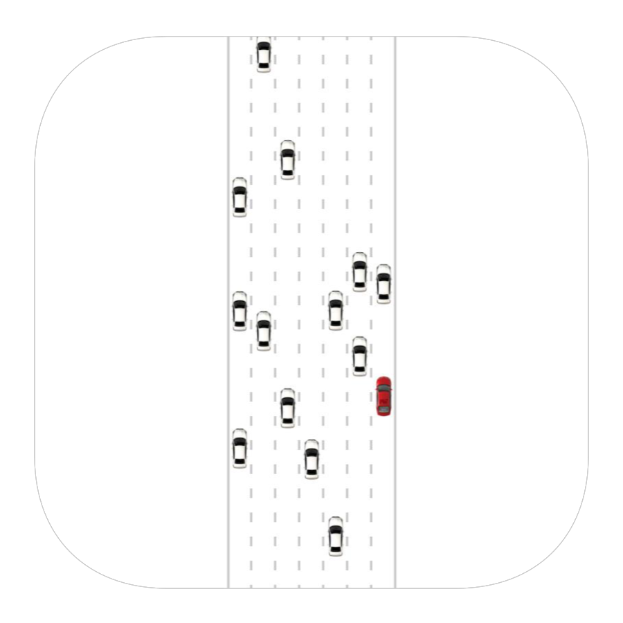

<h3 align="center">
  
</h3>

# Deep Traffic

Top 2% (75.01 mph) solution for the [MIT's DeepTraffic Reinforcment Learning Competition](https://selfdrivingcars.mit.edu/deeptraffic/).

 
Check out corresponding Medium article:

[DeepTraffic - DQN Tuning for Traffic Navigation (75.01 MPH Solution) 🚗](https://towardsdatascience.com/deeptraffic-dqn-tuning-for-traffic-navigation-75-01-mph-solution-23087e2411cf)

# Visualization

<h3 align="center">
  
</h3>
